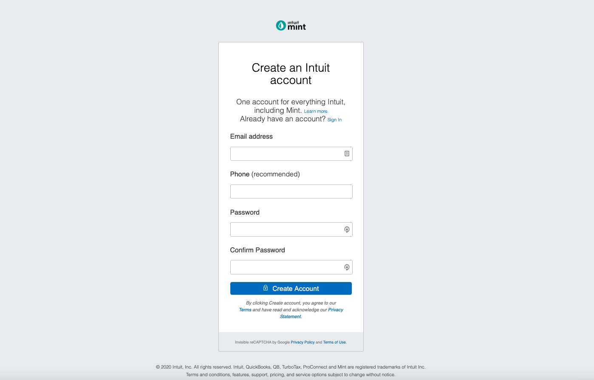

# HTML Forms - Clone of mint.com signup page (Microverse HTML/ CSS Assignment)

## Description
The rubric of this project is to demonstrate the creation of HTML/ CSS forms by designing a clone of the **mint.com** signup page. The specification for this project is a part of the Odin Project.

## Library Directory 📙

| Contents                  |
| ------------------------- |
| [Live Demo](#live-demo) |
| [App Screenshot](#app-screenshot) |
| [Getting Started](#getting-started)   |
| [Built With](#built-with)   |
| [Testing](#testing)   |
| [Authors](#authors)       |
| [License](#license)       |

## Live Demo
[MintSignUpClone live demo](https://raw.githack.com/rloterh/signup-form/signup-form/index.html/).

## App Screenshot

## Getting Started

- [Clone](https://github.com/rloterh/MintSignupClone/.git) this project
- Execute <code>index.html</code> within the directory

## Built With

- HTML
- CSS

## Testing

This project was tested using [W3C Validator](https://validator.w3.org/) and [Stylelint](https://stylelint.io/)
 

### Testing HTML Syntax via W3C Markup Validation Service

1. - Go to [The W3C Markup Validation Service](https://validator.w3.org/#validate_by_upload)
2. - Upload the file named `index.html` in the project directory
3. - Click on the check button to validate
4. - All test cases should pass, when no error message is shown 

### Testing CSS with Stylelint

1. - Ensure node package manager is installed on your computer by going to [npmjs.com](https://www.npmjs.com/get-npm)
2. - Go to the terminal, and navigate to project directory
3. - Run the command `npm install`
4. - Validate the css syntax and code standard by running the command `npx stylelint "**/*.{css,scss}"`
5. - All test cases passes, when no error message is shown in the terminal

## Authors

### 👨‍💻 Robert Loterh

  
  
  
  

 ### 👨‍💻 Mohammad Umarh

  
  
  
 

## 🤝 Contributing

Contributions, issues and feature requests are welcome!

Feel free to check the [issues page](https://github.com/rloterh/MintSignupClone/issues/new).

## Show your support

Give a ⭐️ if you like this project!

## Acknowledgments
- [The Odin Project](https://www.theodinproject.com/)
- [Microverse](https://www.microverse.org/)

### License

