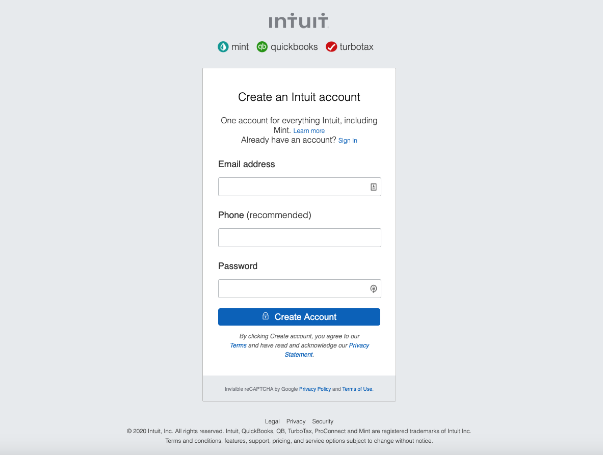

# HTML Forms

> mint.com Signup page clone

>

## Instruction to Run the App

1. Clone the project
2. Run the index.html file

## Built With

- HTML
- CSS

## Live Demo

[Live link](https://raw.githack.com/rloterh/signup-form/signup-form/index.html)

## Authors

👤 **Author1**

- Github: [@rloterh](https://github.com/rloterh)
- Twitter: [@rloterh](https://twitter.com/RLoterh)
- Email: [rloterh@gmail.com](mailto:rloterh@gmail.com)

👤 **Author2**

- Github: [@mohammadumar28](https://github.com/mohammadumar28)
- Twitter: [@Mohammadumar28](https://twitter.com/Mohammadumar28)
- Email: [mohammadumar28@gmail.com](mailto:mohammadumar28@gmail.com)

## Show your support

Give a ⭐️ if you like this project!
